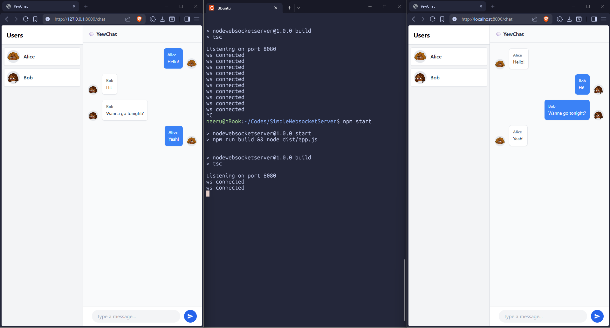

# Module 10 - Asynchronous Programming

# Tutorial 3: WebChat using yew

> DISCLAIMER: This app is a modern implementation of this original tutorial at [https://blog.devgenius.io/lets-build-a-websockets-project-with-rust-and-yew-0-19-60720367399f](https://blog.devgenius.io/lets-build-a-websockets-project-with-rust-and-yew-0-19-60720367399f) which is now outdated and incompatible with modern Rust toolchains. All credits for the original project and design go to the author, but the code has been completely rewritten from scratch to work with the latest versions of Yew, Trunk, and modern Rust async patterns.

## How to run

- Ensure you have Rust and Trunk installed. If not, install Rust from [https://rustup.rs/](https://rustup.rs/) and Trunk using `cargo install trunk`.
- Clone the repository and navigate to the project directory.
- Make sure you have an existing WebSocket server running on port 8080. [The old tutorial suggests using this server. Follow the instructions in the repo to set it up.](https://github.com/jtordgeman/SimpleWebsocketServer)
- In the project directory, run `trunk serve --open` to start the YewChat application.
- The application should automatically open in your default web browser at `http://localhost:8000`. You can start sending messages through the chat interface, and they will be relayed to the WebSocket server on port 8080.
- Open more browser tabs to `http://localhost:8000` to simulate multiple clients and see the real-time chat functionality in action.

## Reflection 2.1 Original code (refactored for modern Rust usage)

While following [the original tutorial](https://blog.devgenius.io/lets-build-a-websockets-project-with-rust-and-yew-0-19-60720367399f) for building the YewChat application, I encountered several insurmountable compatibility issues due to the rapidly evolving Rust WebAssembly ecosystem. The original guide relied on outdated libraries and tools (such as Yew 0.19, reqwasm, yew-agent, and an older Webpack configuration) which resulted in critical WASM parsing errors and incompatible dependencies when compiled with modern Rust toolchains.

To resolve this, I decided to build the application from scratch using a modern approach, ensuring it runs perfectly on the latest standards. Here are the key differences and improvements made during the refactoring process:

- Switched from Webpack to Trunk:

    The original tutorial used Webpack and `npm` to bundle the application, which failed to parse modern WASM Reference Types. I migrated the build system to Trunk, a zero-config WASM bundler for Rust. This completely eliminated the parser errors, removed the need for Node.js configurations in the frontend, and allowed me to easily bind the local server to port `8000` (to avoid port collision with [the NodeJS WebSocket server](https://github.com/jtordgeman/SimpleWebsocketServer) on `8080`).

- Upgraded to Yew 0.21 and Modern Hooks:

    Instead of using older component lifecycles and manually wrapping states in `Rc<RefCell<...>>`, the refactored code leverages modern Yew hooks like `use_state` and `use_context`. For the chat messages array, I implemented `use_mut_ref` to prevent a "stale closure" bug inside the asynchronous loop, ensuring the UI always appends and renders the most up-to-date messages.

- Replaced Event Bus Architecture with `gloo-net`:

    The old implementation relied heavily on `yew-agent` and `mpsc::channel` to create a complex Event Bus acting as a middleman between the WebSocket service and the UI components. In my modern implementation, I discarded this complexity. Instead, I used `gloo-net` to establish a direct WebSocket connection inside a use_effect_with hook within the Chat component itself. Messages are handled asynchronously using `wasm_bindgen_futures::spawn_local`, making the code significantly cleaner and easier to maintain.

- Handling Race Conditions and Payload Formatting:

    Modern Rust executes asynchronous tasks extremely fast. I encountered a race condition where the Rust client attempted to send the Register payload while the socket was still in the `CONNECTING` state, causing the NodeJS server to instantly drop the connection (Code 1006). I solved this by introducing `gloo-timers` to implement a safe 500ms delay, allowing the handshake to complete. Furthermore, I utilized `#[serde(skip_serializing_if = "Option::is_none")]` to dynamically omit the data_array field from the JSON payload when it's not needed, successfully preventing the NodeJS server from crashing due to null value evaluations.

Overall, this refactoring experience provided deep insights into how much the Rust WebAssembly ecosystem has matured, favoring simpler hook-based architectures and dedicated WASM tooling over complex JavaScript bundler integrations.
